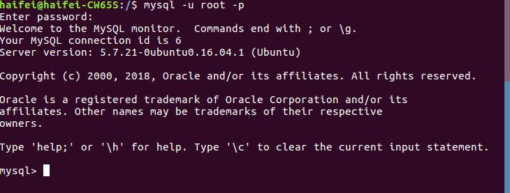
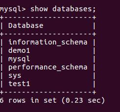
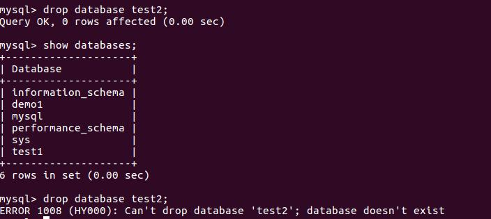
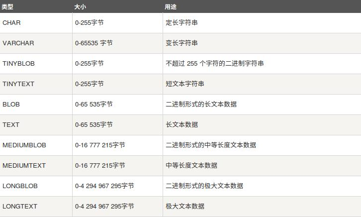
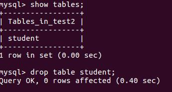
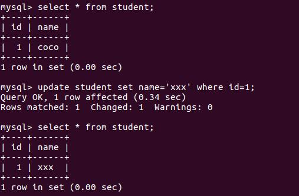

# Mysql数据库的理解

### 1.数据库概念
	数据库（Database）是按照数据结构来组织、存储和管理数据的仓库，每个数据库都有一个或多个不同的API用于创建，访问，管理，搜索和复制所保存的数据。我们也可以将数据存储在文件中，但是在文件中读写数据速度相对较慢。所以，现在我们使用关系型数据库管理系统（RDBMS）来存储和管理的大数据量。所谓的关系型数据库，是建立在关系模型基础上的数据库，借助于集合代数等数学概念和方法来处理数据库中的数据。

#### (1)RDBMS即关系数据库管理系统(Relational Database Management System)的特点：

```python
1.数据以表格的形式出现
2.每行为各种记录名称
3.每列为记录名称所对应的数据域
4.许多的行和列组成一张表单
5.若干的表单组成database
```

#### (2)关系型数据库相关产品

```python
Oracle
DB2
SQL Server
MySQL
SQLite
```

#### (3)关系型数据库术语

```python
数据库: 数据库是一些关联表的集合。
数据表: 表是数据的矩阵。在一个数据库中的表看起来像一个简单的电子表格。
列: 一列(数据元素) 包含了相同的数据, 例如邮政编码的数据。
行：一行（=元组，或记录）是一组相关的数据，例如一条用户订阅的数据。
冗余：存储两倍数据，冗余降低了性能，但提高了数据的安全性。
主键：主键是唯一的。一个数据表中只能包含一个主键。你可以使用主键来查询数据。
外键：外键用于关联两个表。
复合键：复合键（组合键）将多个列作为一个索引键，一般用于复合索引。
索引：使用索引可快速访问数据库表中的特定信息。索引是对数据库表中一列或多列的值进行排序的一种结构。类似于书籍的目录。
参照完整性: 参照的完整性要求关系中不允许引用不存在的实体。与实体完整性是关系模型必须满足的完整性约束条件，目的是保证数据的一致性。
```

### 2.window上Mysql安装

	下载安装地址[mysql地址](https://www.mysql.com/)

```python
启动命令:net start mysql57 或者 mysql -h localhost -u root -p
```


### 3.ubuntu上Mysql安装

```python
安装参数：
MySQL - MySQL服务器。你需要该选项，除非你只想连接运行在另一台机器上的MySQL服务器。
MySQL-client - MySQL 客户端程序，用于连接并操作Mysql服务器。
```


#### (1)安装mysql:
```python
sudo apt-get install mysql mysql-client
```

#### (2)使用Mysql客户端进行连接Mysql的命令

	先使用mysql命令连接到mysql的服务器，输入安装的时候自己设置的密码
```python
mysql -u root -p
```
	然后输入mysql的密码即可进入mysql数据库中
	
	如下就是进入mysql中的图：



### 4.简单的SQL命令

#### (1)查看当前mysql中有哪些数据库

```python
show databases;
```
	如下展示了mysql中已存在的数据库



#### (2)创建数据库

	创建数据库的时候，需要指定编码charset=utf-8,要不然存储中文会出现乱码

```python
create database test charset=utf8;
```


**注意：**

```python
1. create database 语句的后面是要创建的数据库名称。数据库名称尽可能是有意义和具有一定的描述性。
2. 重复创建同一个数据库是会提示你，数据库已经存在了
```

**改进方案：**

```python
create database if not exists database_name

注意: if not exists是语句的可选子句。
     if not exists子句可防止创建数据库服务器中已存在的新数据库的错误。
     不能在MySQL数据库服务器中具有相同名称的数据库。
```


#### (3)删除数据库

```python
drop database test;
```



**注意：**删除重复的同一个数据库的时候是会提醒你，数据库不存在了

**改进方案：**

```python
drop database if exists test;

与create database语句类似，if exists是该语句的可选部分，以防止您删除数据库服务器中不存在的数据库。
```

#### (4)选择数据库

```python
use test;
```
```python
你连接到 MySQL 数据库后，可能有多个可以操作的数据库，所以你需要选择你要操作的数据库。 必须通过使用USE语句告诉MySQL要使用哪个数据库。
从现在开始，所有操作(如查询数据，创建新表, 增加表数据，删除表数据)都将对当前数据库(即test)产生影响。
```

#### (5)数据类型

```python
MySQL支持多种类型，大致可以分为三类：数值、日期/时间、字符串(字符)类型。 
```

**数值类型：**


**日期和时间类型：**

	表示时间值的日期和时间类型为DATETIME、DATE、TIMESTAMP、TIME和YEAR。每个时间类型有一个有效值范围和一个"零"值，当指定不合法的MySQL不能表示的值时使用"零"值。


**字符串类型：**




#### (6)创建表

	语法：create table table_name (column_name column_type);

```python
创建MySQL数据表需要以下信息：
表名
表字段名
定义每个表字段
```

```python
create table tb_student
(
stuid int not null auto_increment comment '学号',
stuname varchar(20) not null comment '学生姓名',
stusex bit default 1 comment '性别',
stubirth date not null comment '出生日期',
stuaddr varchar(255) default '' comment '籍贯',
collid int not null comment '所属学院编号',
primary key (stuid)
)engine=InnoDB default charset=utf8;
```

**解析：**

```python
1. 如果你不想字段为空 可以设置字段的属性为 not null， 在操作数据库时如果输入该字段的数据为null，就会报错。
2. auto_increment定义列为自增的属性，一般用于主键，数值会自动加1。
3. int 定义的字段为整形
4. varchar 定义可变的字符串，最大的长度为*
5. primary key关键字用于定义列为主键。
6. engine 设置存储引擎。
7. charset 设置编码。
```

#### (7)删除表
删除表的语法很简单，删除表的同时，表里面的所有信息都会被删除掉，所以该操作需要很小心。

```python
语法:drop table table_name;
```



***


#### (8)增数据
```python
语法：inset into table_name (file1, file2, file3) values (value1, value2, value3)
```


#### (9)查数据

**语法：**

```python
select column_name1, column_name2 
from table_name
where [offset m]

select count(*) from 表名  查询有多少行
```

**注解：**

```python
1）查询语句中你可以使用一个或者多个表，表之间使用逗号(,)分割，并使用WHERE语句来设定查询条件。
2）SELECT 命令可以读取一条或者多条记录。
3）可以使用星号（*）来代替其他字段，SELECT语句会返回表的所有字段数据
4）可以使用 WHERE 语句来包含任何条件。
5）可以使用 LIMIT 属性来设定返回的记录数。
6）可以通过OFFSET指定SELECT语句开始查询的数据偏移量。默认情况下偏移量为0。
```

```python
例如：select id,name from student where name='coco';
```


#### (10)改数据

**语法：**

```python
update table_name set field1=value1 fields2=value2 
[where]
```

**注解：** 

```python
1) 可以同时更新一个或多个字段。
2) 可以在 WHERE 子句中指定任何条件。
```

```python
例如：update student set name='xxx' where id=1;
```



#### (11)删数据

**语法：**

```python
delete from table_name [where]
```

**注解：**

```python
1）如果没有指定 WHERE 子句，MySQL 表中的所有记录将被删除。
```

```python
例如： delete from student where name='xxx';
```


### 5.进阶

#### (1)主键

**语法：**

```python
alter table table_name add primary KEY(primary_key_column);
```

**注解：**

```python
1）简单而言，主键就是一个用来唯一标识表中的每行记录
2）主键的值必须是唯一的，非空的，每个表只有一个主键
3）主键的数据类型，int 类型
4）主键通常设为 auto_increment，自动生成唯一的序列值
```

#### (2)外键

**语法：**一张表中有一个非主键的字段指向了别一张表中的主键，就将该字段叫做外键。

```python
alter table table_name1 add [constraint 约束名] foreign key(外键字段名) references table_name2(主键字段名);
```

**使用外键的前提：**

```python
1. 表储存引擎必须是innodb，否则创建的外键无约束效果。
2. 外键的列类型必须与父表的主键类型完全一致。
3. 外键的名字不能重复。
4. 已经存在数据的字段被设为外键时，必须保证字段中的数据与父表的主键数据对应起来。
```

 #### (3)外键约束
```python
on delete 和 on update都有restrict，no action, cascade, set null属性。以下分别对他们的属性含义的解释。
```

**1). on delete**

```python
restrict(约束): 当在父表（即外键的来源表）中删除对应记录时，首先检查该记录是否有对应外键，如果有则不允			    许删除。

no action: 意思同restrict.即如果存在从数据，不允许删除主数据。

cascade(级联): 当在父表（即外键的来源表）中删除对应记录时，首先检查该记录是否有对应外键，如果有则也删			  除外键在子表（即包含外键的表）中的记录。

set null: 当在父表（即外键的来源表）中删除对应记录时，首先检查该记录是否有对应外键，如果有则设置子表中		  该外键值为null（不过这就要求该外键允许取null。
```

**2). on update**

```python
restrict(约束): 当在父表（即外键的来源表）中更新对应记录时，首先检查该记录是否有对应外键，如果有则不允				许更新。

no action: 意思同restrict.

cascade(级联): 当在父表（即外键的来源表）中更新对应记录时，首先检查该记录是否有对应外键，如果有则也更				新外键在子表（即包含外键的表）中的记录。

set null: 当在父表（即外键的来源表）中更新对应记录时，首先检查该记录是否有对应外键，如果有则设置子表中			该外键值为null（不过这就要求该外键允许取null）。
```

#### (4)索引

```python
什么是索引:
	MySQL索引的建立对于MySQL的高效运行是很重要的，索引可以大大提高MySQL的检索速度。打个比方，如果合理的设计且使用索引的MySQL是一辆兰博基尼的话，那么没有设计和使用索引的MySQL就是一个人力三轮车。
    实际上，索引也是一张表，该表保存了主键与索引字段，并指向实体表的记录。但过多的使用索引将会造成滥用。因此索引也会有它的缺点：虽然索引大大提高了查询速度，同时却会降低更新表的速度，如对表进行INSERT、UPDATE和DELETE。因为更新表时，MySQL不仅要保存数据，还要保存一下索引文件。
```

**创建语法：**

```python
create index [index_name索引名] on table_name([column_name 列名]);
```

**删除语法：**

```python
drop index [index_name 索引名] on table_name;
```

**查看语法：**

```python
show index from table_name;
```

**修改语法：**

```python
alter table table_name add unique [index_name 索引名]
```

#### (5)聚合函数

```python
什么是聚合函数：对统计的结果进行二次筛选：分组，排序，算和，计算最大值，最小值，求取平均值等

   1）group by 字段 ：按字段将记录分组，通常和其它的函数联合使用，group by 操作后，返回每一组的第一						条记录
   2）order by:根据指定字段进行排序，默认升序(asc)排序，可以指定多个排序字段，按照字段先后分别排序。
   3）sum(expr):求和
   4）avg(expr):求平均数
   5）count(expr):计数器，返回SELECT语句检索到的行中非NULL值的数目
   6）max(expr) 获取最大值
   7）min(expr) 获取最小值
```


### 6. 其他查询方法

#### (1)介于什么之间

```python
关键字：between  and 
作用：用来查询过滤信息，在一个范围内的搜素结果。
```

#### (2)模糊查询
**1）关键字： like**
	**作用：**用来模糊查询

```python
例如： 查询学生表中姓王的同学
select stuname, stusex from TbStudent where stuname like '王%';

例如： 查询学生表中姓名中有王字的同学
select stuname from TbStudent where stuname like '%王%';
```
**2）关键字： _**
	**作用：**用来模糊查询，但是只能有一个模糊查询的位数

```python
例如：查询姓郭名字总共两个字的学生的姓名(模糊)
select stuname from TbStudent where stuname like '郭_';

例如：查询姓郭名字总共三个字的学生的姓名(模糊)
select stuname from TbStudent where stuname like '郭_ _';
```

#### (3)去重

**关键词： distinct**
	**作用：**去除重复性的数据

```python
例如：所有学生中语文成绩（去重）
select distinct s_yuwen from TbStudent;     
```

#### (4)判断

**关键词：if(字段,exp1,exp2) 或者 ifnull(字段,exp1,,exp2)**
	**作用：**if表达式中如果字段值为真则返回exp1的值，如果为假的话，返回exp2的值.
     		    ifnull表达式中如果字段的值为假则返回exp1的值，如果为假的话，返回exp2的值

```python
例如： 查询男女学生的人数(分组和聚合函数)
select if(stusex, '男', '女') as `性别`, count(stusex) as `人数` from TbStudent group by stusex;
```

#### (5)分组聚合

**关键词： group by having**
	**作用：**having语句通常与group by语句联合使用，用来过滤由group by语句返回的记录集。
    		   having语句的存在弥补了where关键字不能与聚合函数联合使用的不足

```python
例如：查询平均成绩大于等于90分的学生的学号和平均成绩
select sid as `学号`, avg(score) as `平均成绩` from TbSC group by sid having avg(score)>=90;
```

#### (6)关联

**定义**  A inner/left/right  join B操作中，A表被称为左表，B表被称为右表。

**a) 内关联： Inner Join on**

```python
作用：仅对满足连接条件的列进行关联，其中inner可省略
```

**b) 左外连接：Left Outer Jion on**

```python
作用：其中outer可以省略。如A left join B，会输出左表A中所有的数据，同时将符合ON条件的右表B中搜索出来	 的结果合并到左表A表中，如果A表中存在而在B表中不存在，则结果集中会将查询的B表字段值（如此处的P.PUNISHMENT字段）设置为NULL。
	
left join的作用是：从右表B中将符合ON条件的结果查询出来，合并到A表中，再作为一个结果集输出。
```

**c) 右外连接：Right Outer Jion on**

```python
作用：其中outer可以省略，而right join刚好相反，“A right join B ON ……”是将符合ON条件的A表搜索结果	 合并到B表中，作为一个结果集输出：
```


