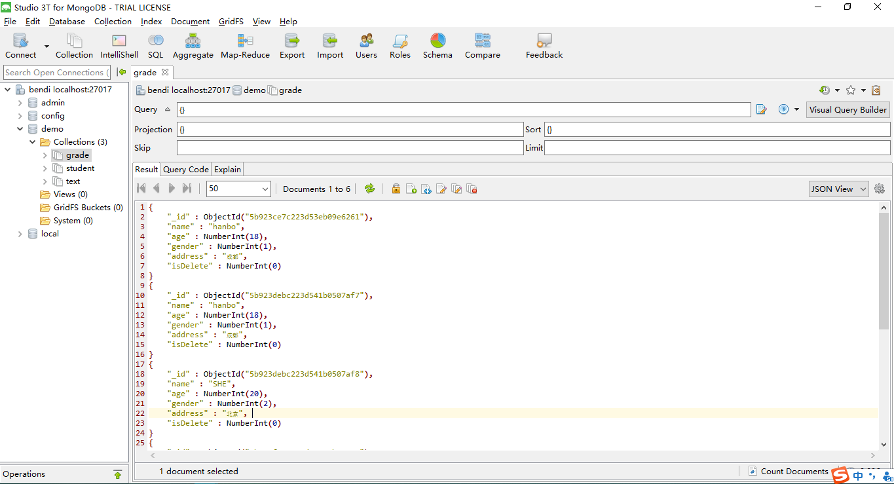

# MongoDB数据库语法

### 1. 数据库的创建，删除，切换

```python
> // 显示所有数据库
> show dbs
admin   0.000GB
config  0.000GB
local   0.000GB

> // 创建并切换到spider数据库
> use spider
switched to db spider

> // 删除当前数据库
> db.dropDatabase()
{ "ok" : 1 }

> //查看正在使用的数据库
> db 或者 db.getName()
spider

> //断开连接
> exit

> //查看命令api
> help
```

**注意：**如果第一次use spider会创建spider数据库的，但是立马show dbs的时候，并不会展示出当前刚创建的spider的数据库，需要在该数据库下创建了文档才能show dbs看到spider数据库的。

### 2. 集合的创建、删除、查看

```python
> // 创建并切换到school数据库
> use school
switched to db school

> // 创建colleges集合
> db.createCollection('colleges')
{ "ok" : 1 }

> // 创建students集合
> db.createCollection('students')
{ "ok" : 1 }

> // 查看所有集合
> show collections
colleges
students

> // 删除colleges集合
> db.colleges.drop()
true
```

### 3. 对文档的CRUD操作

```python
> // 向students集合插入文档
> db.students.insert({s_id: 1, name: '王大帅', age: 18})
WriteResult({ "nInserted" : 1 })

> // 向students集合插入文档
> db.students.save({s_id: 2, name: '王帅帅', tel: '12334566789', gender: '男'})
WriteResult({ "nInserted" : 1 })

> // 查看所有文档
> db.students.find()
{ "_id" : ObjectId("5b24b01f165a0f78dbf82a12"), "s_id" : 2, "name" : "王帅帅", "tel" : "12334566789", "gender" : "男" }
{ "_id" : ObjectId("5b24b0dc165a0f78dbf82a15"), "s_id" : 1, "name" : "王大帅", "age" : 18 }

> // 更新s_id为1的文档  //$set表示直接更新  $inc在原有的基础上累加更新
> db.students.update({'s_id':1}, {'$set':{'age':16}})
WriteResult({ "nMatched" : 1, "nUpserted" : 0, "nModified" : 1 })

> //更新s_id为1的姓名
> db.students.update({'s_id':1}, {'$set':{'name':'非常帅'}})
{ "_id" : ObjectId("5b4427f9c03e2f1fece215dd"), "s_id" : 1, "name" : "非常帅", "age" : 18 }

> // 添加新的age字段
> db.students.update({'s_id':1}, {'$addToSet':{'$set':{'age':18}}})
> db.students.find()
> { "_id" : ObjectId("5b4427f9c03e2f1fece215dd"), "s_id" : 1, "name" : "非常帅", "age" : 18 }

> // 插入或更新s_id为3的文档
> db.students.update({s_id: 3}, {'$set': {name: '小妲己', tel: '13022221333', gender: '女'}},  upsert=true)
WriteResult({
        "nMatched" : 0,
        "nUpserted" : 1,
        "nModified" : 0,
        "_id" : ObjectId("5b24b30d4717832ad090f2f5")
})

> // 查询所有文档
> db.students.find().pretty()
{
	"_id" : ObjectId("5b24b01f165a0f78dbf82a12"),
	"s_id" : 2,
	"name" : "王帅帅",
	"tel" : "12334566789",
	"gender" : "男"
}
{
	"_id" : ObjectId("5b24b0ba165a0f78dbf82a14"),
	"s_id" : 2,
	"name" : "王帅帅",
	"tel" : "12334566789",
	"gender" : "男"
}
{
	"_id" : ObjectId("5b24b0dc165a0f78dbf82a15"),
	"s_id" : 1,
	"name" : "王大帅",
	"tel" : "12334566786",
	"age" : 16
}
{
	"_id" : ObjectId("5b24b30d4717832ad090f2f5"),
	"s_id" : 3,
	"gender" : "女",
	"name" : "小妲己",
	"tel" : "13022221333"
}

> // 删除文档
db.集合名.remove(
	query,
    {
        justOne:<boolean>
        writeConcern:<document>
    }
)
参数说明:
    query: 可选, 删除的文档的条件
	justOne: 可选, 如果为true或1, 则只删除一个文档
	writeConcern: 可选, 跑出异常的级别
示例:db.student.remove({name:'hanbo'})
```

**注意:** 我们可以使用 **find() 方法**来查询指定字段的数据，将要返回的字段对应值设置为 1。但是除了 _id 你不能在

一个对象中同时指定 0 和 1。否则同时制定0和1的话，会报错误的。
	

```python
>> // (1)查询s_id大于2的文档只显示name和tel字段
> db.students.find({s_id: {'$gt': 2}}, {_id: 0, name: 1, tel: 1}).pretty()

>> // (2)查询s_id大于2的文档除了不显示name和tel字段的其他字段
> db.students.find({s_id:{'$gt':2}}, {s_id:0, name:0, _id:0})
{ "gender" : "女", "tel" : "13022221333" }

>> // (3)查询s_id大于2的文档只显示_id和name和tel字段
> db.students.find({s_id:{'$gt':2}}, {s_id:1, name:1, _id:1})
{ "_id" : ObjectId("5b24b30d4717832ad090f2f5"), "s_id" : 3, "name" : "小妲己" }
```

**筛选查询：**

```python
>>// (4)查询学生文档跳过第1条文档只查1条文档
> db.students.find().skip(1).limit(1).pretty()
{
	"_id" : ObjectId("5b24b0ba165a0f78dbf82a14"),
	"s_id" : 2,
	"name" : "王帅帅",
	"tel" : "12334566789",
	"gender" : "男"
}
```


```python
> // (5)对查询结果进行排序(1表示升序，-1表示降序)
> db.students.find().sort({s_id: -1})
{ "_id" : ObjectId("5b24b30d4717832ad090f2f5"), "s_id" : 3, "gender" : "女", "name" : "小妲己", "tel" : "13022221333" }
{ "_id" : ObjectId("5b24b01f165a0f78dbf82a12"), "s_id" : 2, "name" : "王帅帅", "tel" : "12334566789", "gender" : "男" }
{ "_id" : ObjectId("5b24b0ba165a0f78dbf82a14"), "s_id" : 2, "name" : "王帅帅", "tel" : "12334566789", "gender" : "男" }
{ "_id" : ObjectId("5b24b0dc165a0f78dbf82a15"), "s_id" : 1, "name" : "王大帅", "tel" : "12334566786", "age" : 16 }
```

**模糊查询：**

```python
>> db.getCollection('later_movies').find({'name':{'$regex':'勇者'}})
```

### python连接mongodb

```python
import pymongo   # 用于降序
from pymongo import MongoClient
from bson.objectid import ObjectId  # 用于id查询

# 连接服务器
conn = MongoClient('localhost', 27017)

# 连接数据库
db = conn.demo

# 获取集合
collection = db.grade

# 添加文档--------------------------------------------------------------------------
collection.insert([{'name':'wang', 'age':10, 'gender':1, 'address':'成都', 'isDelete':0},\
                   {'name':'zhang', 'age':15, 'gender':2, 'address':'重庆', 'isDelete':0},\
                   {'name': 'zhou', 'age': 30, 'gender': 3, 'address': '成都', 'isDelete': 0},\
                   {'name': 'sun', 'age': 40, 'gender': 1, 'address': '四川', 'isDelete': 0}])


# 查询文档--------------------------------------------------------------------------
# (1)查询部分文档
# res = collection.find({'age':{'$gt':18}})
# (2)查询所有文档
# res = collection.find()
# 查询到的结果是一个列表, 需遍历
# for row in res:
#     print(row)
#     print(type(row))  # <class 'dict'>
#     print(row['name'])

# (3)统计查询
# res = collection.find({'age':{'$gt':18}}).count()
# print(res)

# (3)id查询  需要引入import pymongo
# res = collection.find({'_id':ObjectId('5b923debc223d541b0507af7')})
# print(res[0])

# (4)排序
# res = collection.find().sort('age')  # 升序
# res = collection.find().sort('age', pymongo.DESCENDING)  # 降序
# for row in res:
#     print(row)

# (5)分页查询
# res = collection.find().skip(2).limit(5)
# for row in res:
#     print(row)

# 更新文档--------------------------------------------------------------------------
# collection.update({'name':'sun'}, {'$set':{'age':66}})

# 删除文档--------------------------------------------------------------------------
# collection.remove({'name':'zhou'})
# 全部删除
# collection.remove()

# 断开
conn.close()
```

